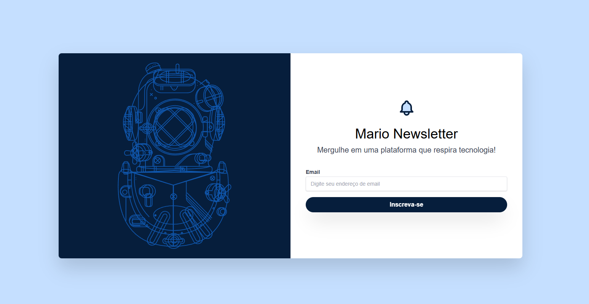

# Estudo de Tailwind CSS - Componente de Newsletter

Este é um projeto de estudo focado na utilização do framework CSS **Tailwind CSS** para a criação de um componente de inscrição em newsletter. O objetivo é demonstrar a flexibilidade e o poder do Tailwind na estilização de componentes web modernos e responsivos, sem a necessidade de escrever CSS customizado.

O projeto consiste em duas páginas:
1.  `index.html`: Uma página simples de "Olá Mundo" para demonstrar o uso básico do Tailwind.
2.  `newsletter.html`: Um componente de formulário de newsletter mais elaborado.

 - [Link para o projeto](https://tailwind.weboliveira.top)
  - [Link GitHub](https://github.com/marioleme/tailwind-css-estilizando)


## 🚀 Tecnologias Utilizadas

-   **HTML5**
-   **Tailwind CSS v3** (utilizado via CDN)

## Desktop


## Mobile

## animacão  (Hover)


## ✨ Funcionalidades Demonstradas

-   **Design Responsivo**: O layout se adapta para telas grandes (desktop) e pequenas (mobile) usando os prefixos responsivos do Tailwind (ex: `lg:`).
-   **Tema Customizado**: Cores, fontes e animações personalizadas para se adequar a uma identidade visual específica.
-   **Estados Interativos**: Efeitos de `hover` e `focus` em botões e campos de formulário para uma melhor experiência do usuário.
-   **Animações Customizadas**: Uma animação sutil de sino (`animate-sino`) ao passar o mouse sobre o ícone.
-   **SVG Styling**: Estilização de SVGs diretamente com classes do Tailwind (`fill-`, `stroke-`).

##  Tailwind CSS em Ação

Este projeto aproveita várias características do Tailwind CSS para criar uma interface rica e funcional.

### 1. Configuração via Script

Para simplificar o setup, a configuração do Tailwind é injetada diretamente no arquivo `newsletter.html` através de uma tag `<script>`. Isso permite a extensão do tema padrão do framework.

```html
<script>
    tailwind.config = {
        theme: {
            extend: {
                colors: {
                    azul: {
                        claro: '#C5DFFF',
                        escuro: '#061E3C',
                        hover: '#1057B0'
                    },
                },
                fontFamily: {
                    inter: ['Inter', 'sans-serif']    
                },
                keyframes: {
                    sino_kf: {
                        '0%, 100%': { transform: 'rotate(-10deg)' },
                        '50%': { transform: 'rotate(10deg)' }
                    }
                },
                animation: {
                    sino: 'sino_kf 0.31s ease-in-out infinite'
                }
            }
        }
    }
</script>
```

-   **`colors`**: Adicionamos uma paleta de cores customizada chamada `azul` com as variações `claro`, `escuro` e `hover`. Isso nos permite usar classes como `bg-azul-claro` e `hover:bg-azul-hover`.
-   **`fontFamily`**: Definimos a fonte `Inter` como padrão para o projeto com a classe `font-inter`.
-   **`animation` e `keyframes`**: Criamos uma animação customizada chamada `sino` para o efeito de balanço do ícone, que é ativada com a classe `animate-sino`.

### 2. Classes Utilitárias em Destaque

O layout e o estilo são construídos inteiramente com as classes utilitárias do Tailwind.

-   **Layout e Flexbox**:
    -   `flex`, `justify-center`, `items-center`: Para centralizar o conteúdo na página e dentro dos contêineres.
    -   `flex-col lg:flex-row`: Define a direção da flexbox como coluna em telas pequenas e linha em telas grandes (`lg`).
    -   `w-1/2`, `gap-6`, `p-10`: Para controlar largura, espaçamento entre elementos e preenchimento (padding).

-   **Responsividade**:
    -   `hidden lg:block`: Esconde a imagem do mergulhador em telas pequenas e a exibe em telas grandes.
    -   `lg:w-3/4`, `lg:rounded-l-none`: Aplica classes específicas apenas em breakpoints maiores, garantindo a adaptação do layout.

-   **Estilização e Estados**:
    -   `hover:bg-azul-hover`: Altera a cor de fundo do botão quando o mouse está sobre ele.
    -   `focus:border-azul-escuro focus:ring-1`: Melhora a acessibilidade e a experiência do usuário ao focar no campo de e-mail.
    -   `group-hover:animate-sino`: Utiliza a variante `group-hover` para aplicar a animação `sino` no ícone SVG quando o mouse está sobre o contêiner pai (`group`).

## 🛠️ Como Executar

Como este projeto utiliza o Tailwind CSS via CDN, não há necessidade de um processo de compilação (`build`).

1.  Clone este repositório (ou apenas baixe os arquivos).
2.  Abra o arquivo `newsletter.html` ou `index.html` em seu navegador de preferência.


 